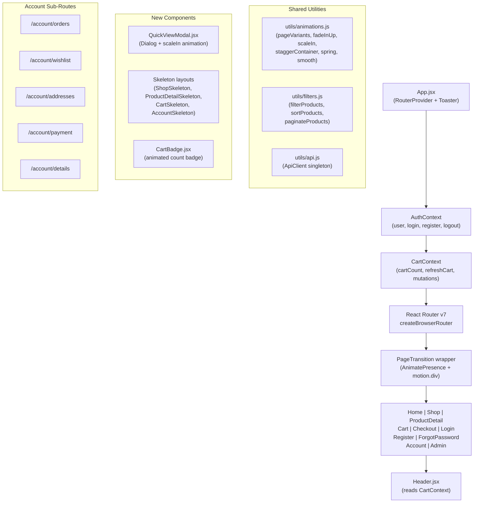
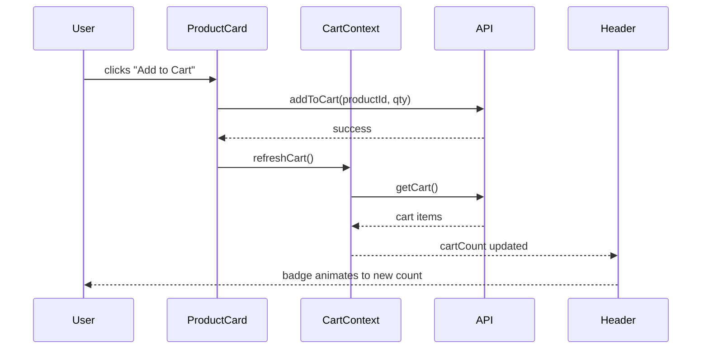

# Design Document: UI/UX Overhaul

## Overview

This document describes the technical design for the CHILALOSHOP UI/UX overhaul. The goal is to transform the existing solid-but-incomplete frontend into a polished, fully functional e-commerce experience. The overhaul covers: a centralized animation system, page transitions, redesigned auth forms with micro-interactions, skeleton loading states, reactive cart state, functional shop filters and pagination, a Quick View modal, checkout flow completion, account sub-routes, and dependency cleanup.

The project is a React 18 + Vite SPA using Tailwind CSS v4, shadcn/ui (Radix UI primitives), the `motion` package (Framer Motion v12), `sonner` for toasts, and React Router v7. The backend is Node.js/Express + Prisma.

### Key Design Decisions

- **Extend `animations.js`, don't replace it.** The file already has most of the needed primitives. We add the missing `pageVariants`, `spring`/`smooth` presets, and update `fadeInUp` to use `y: 20` (currently `y: 8`) to match requirements.
- **Cart state via React Context.** A new `CartContext` wraps the app and exposes `cartCount`, `refreshCart`, and mutation helpers. This avoids prop-drilling and keeps the Header reactive without a third-party state library.
- **Filter logic stays in `Shop.jsx`.** All filter/sort/pagination state lives in the Shop component. Pure filter/sort functions are extracted to `src/app/utils/filters.js` for testability.
- **Account sub-routes via nested React Router routes.** Each account section becomes its own component rendered inside the existing `Account` layout.
- **No new UI libraries.** All new UI uses existing shadcn/ui primitives (Dialog for Quick View, Skeleton for loading states).

---

## Architecture



### Data Flow: Cart Reactivity



---

## Components and Interfaces

### `CartContext` (new)

```jsx
// src/app/context/CartContext.jsx
const CartContext = createContext(null);

// Exposed value shape:
{
  cartCount: number,          // total item quantity
  cartItems: CartItem[],      // full cart data
  loading: boolean,
  refreshCart: () => Promise<void>,
  addToCart: (productId, qty, size, color) => Promise<void>,
  removeFromCart: (itemId) => Promise<void>,
  updateCartItem: (itemId, qty) => Promise<void>,
  clearCart: () => Promise<void>,
}
```

`CartContext` wraps `AuthContext` — it only fetches cart data when `isAuthenticated` is true. On logout, `cartCount` resets to 0.

### `PageTransition` (new)

```jsx
// src/app/components/PageTransition.jsx
// Wraps each route's page component
<AnimatePresence mode="wait">
  <motion.div
    key={location.pathname}
    variants={pageVariants}
    initial="initial"
    animate="animate"
    exit="exit"
    transition={smooth}
  >
    {children}
  </motion.div>
</AnimatePresence>
```

Applied in `Root` layout by wrapping `<Outlet />` with `<PageTransition>`.

### `QuickViewModal` (new)

```jsx
// src/app/components/QuickViewModal.jsx
// Props: { product, open, onClose }
// Uses: Dialog from src/app/components/ui/dialog.jsx
// Animation: scaleIn variant on DialogContent
```

`ProductCard` gains an `onQuickView` prop. The parent (Shop page, Home page) manages `quickViewProduct` state and renders `<QuickViewModal>`.

### `animations.js` updates

The existing file is extended (not replaced) with:

```js
// New / updated exports:
export const pageVariants = {
  initial: { opacity: 0, y: 8 },
  animate: { opacity: 1, y: 0 },
  exit: { opacity: 0, y: -8 },
};

// fadeInUp updated: y: 20 (was y: 8)
export const fadeInUp = {
  initial: { opacity: 0, y: 20 },
  animate: { opacity: 1, y: 0 },
  exit: { opacity: 0, y: 20 },
};

export const spring = { type: "spring", stiffness: 400, damping: 30 };
export const smooth = { type: "tween", ease: "easeOut", duration: 0.35 };

// staggerContainer updated: staggerChildren: 0.05 (50ms)
export const staggerContainer = {
  initial: {},
  animate: { transition: { staggerChildren: 0.05, delayChildren: 0.05 } },
};
```

### `filters.js` (new)

```js
// src/app/utils/filters.js
export function filterProducts(products, filters) { ... }
export function sortProducts(products, sortOption) { ... }
export function paginateProducts(products, page, pageSize) { ... }
export function getPageCount(totalItems, pageSize) { ... }
export function getPaginationLabel(page, pageSize, total) { ... }
```

These are pure functions with no side effects, making them straightforwardly testable.

### `Header.jsx` updates

- Reads `cartCount` from `CartContext` instead of `useState(3)`.
- Cart badge wrapped in `AnimatePresence`; uses `motion.span` with scale pulse on count change.
- Nav links updated: "Categories" → `/shop`, "New Arrivals" → `/shop?badge=New`, "Sale" → `/shop?badge=Sale`, "About" → `/shop` (fallback).
- User icon → `/account` (or `/login` if unauthenticated).
- Heart icon → `/account/wishlist` (or `/login` if unauthenticated).
- Mega menu gains keyboard support (`onKeyDown` for Enter/Space/Escape).
- Mobile drawer includes all mega menu links.

### `Input.jsx` updates

- `leadingIcon` container gains `group-focus-within:text-primary transition-colors` so the icon color transitions on focus.
- Floating label animation: when `label` prop is provided and field has value or is focused, label translates up and reduces font size via CSS `peer` classes.

### Account sub-routes

New files under `src/app/pages/account/`:
- `Orders.jsx` — paginated order list from `api.getOrders()`
- `Wishlist.jsx` — product grid from wishlist API
- `Addresses.jsx` — address CRUD form
- `PaymentMethods.jsx` — saved payment methods list
- `AccountDetails.jsx` — profile update form

Routes registered in `routes.jsx` as children of `/account/*`.

---

## Data Models

### Cart State (client-side)

```ts
interface CartItem {
  id: string;
  productId: string;
  product: Product;
  quantity: number;
  size: string;
  color: string;
}

interface CartState {
  items: CartItem[];
  count: number;   // sum of all item quantities
}
```

### Filter State (Shop page)

```ts
interface FilterState {
  categories: string[];
  sizes: string[];
  colors: string[];       // color names
  minPrice: number | '';
  maxPrice: number | '';
  minRating: number | null;
  inStockOnly: boolean;
  sortOption: SortOption;
  currentPage: number;
}

type SortOption =
  | 'Featured'
  | 'Price: Low to High'
  | 'Price: High to Low'
  | 'Newest Arrivals'
  | 'Highest Rated';
```

### Animation Variants (shape contract)

```ts
interface MotionVariant {
  initial: Record<string, unknown>;
  animate: Record<string, unknown>;
  exit?: Record<string, unknown>;
}

interface TransitionPreset {
  type: string;
  [key: string]: unknown;
}
```

### Checkout State

```ts
interface CheckoutState {
  step: 1 | 2 | 3 | 4;
  shipping: ShippingAddress;
  paymentMethod: 'card' | 'paypal';
  cardDetails: CardDetails;
  cartItems: CartItem[];
  orderId: string | null;   // set after successful order creation
}
```

---

## Correctness Properties

*A property is a characteristic or behavior that should hold true across all valid executions of a system — essentially, a formal statement about what the system should do. Properties serve as the bridge between human-readable specifications and machine-verifiable correctness guarantees.*

This feature is a UI/UX overhaul. Most acceptance criteria concern visual rendering, animation timing, and component structure — areas not suited to property-based testing. However, the filter/sort/pagination logic in `filters.js` consists of pure functions over collections, making them ideal candidates for property-based testing. The animation system exports are structural contracts that can be verified with example-based tests.

**PBT library:** [fast-check](https://github.com/dubzzz/fast-check) — the leading property-based testing library for JavaScript/TypeScript.

### Property 1: Price filter preserves only in-range products

*For any* list of products and any price range [min, max] where min ≤ max, every product returned by `filterProducts` with that price range SHALL have a `price` greater than or equal to `min` and less than or equal to `max`.

**Validates: Requirements 8.1**

### Property 2: Size filter preserves only matching products

*For any* list of products and any size string, every product returned by `filterProducts` with that size filter SHALL have the selected size present in its `sizes` array.

**Validates: Requirements 8.2**

### Property 3: Color filter preserves only matching products

*For any* list of products and any color name string, every product returned by `filterProducts` with that color filter SHALL have a color entry whose `name` matches the selected color in its `colors` array.

**Validates: Requirements 8.3**

### Property 4: Rating filter preserves only qualifying products

*For any* list of products and any minimum rating value between 1 and 5, every product returned by `filterProducts` with that rating filter SHALL have a `rating` greater than or equal to the minimum value.

**Validates: Requirements 8.4**

### Property 5: In-stock filter preserves only available products

*For any* list of products, when the `inStockOnly` filter is enabled, every product returned by `filterProducts` SHALL have `inStock === true`.

**Validates: Requirements 8.5**

### Property 6: Sort by price ascending produces non-decreasing sequence

*For any* list of products, after `sortProducts` with "Price: Low to High", for every consecutive pair of products (a, b) in the result, `a.price` SHALL be less than or equal to `b.price`.

**Validates: Requirements 8.6**

### Property 7: Sort by price descending produces non-increasing sequence

*For any* list of products, after `sortProducts` with "Price: High to Low", for every consecutive pair of products (a, b) in the result, `a.price` SHALL be greater than or equal to `b.price`.

**Validates: Requirements 8.6**

### Property 8: Sort by rating descending produces non-increasing sequence

*For any* list of products, after `sortProducts` with "Highest Rated", for every consecutive pair of products (a, b) in the result, `a.rating` SHALL be greater than or equal to `b.rating`.

**Validates: Requirements 8.6**

### Property 9: Pagination returns correct slice

*For any* list of products, any page number p ≥ 1, and page size n ≥ 1, `paginateProducts(products, p, n)` SHALL return the same elements as `products.slice((p - 1) * n, p * n)`.

**Validates: Requirements 9.3**

### Property 10: Pagination label is always accurate

*For any* current page p, page size n, and total product count t, `getPaginationLabel(p, n, t)` SHALL return a string containing the correct start index `(p - 1) * n + 1`, end index `min(p * n, t)`, and total `t`.

**Validates: Requirements 9.8**

### Property 11: Filter composition preserves all constraints simultaneously

*For any* list of products and any combination of active filters (price range, size, color, rating, inStock), every product returned by `filterProducts` SHALL satisfy ALL active filter constraints simultaneously — no single filter's constraint is violated by the presence of other filters.

**Validates: Requirements 8.1, 8.2, 8.3, 8.4, 8.5**

### Property 12: Password mismatch always triggers validation error

*For any* two strings `password` and `confirmPassword` where `password !== confirmPassword`, the confirm password validation function SHALL return a non-empty error message string.

**Validates: Requirements 4.3, 4.4**

### Property 13: Cart count equals sum of item quantities

*For any* array of cart items, the `cartCount` derived from `CartContext` SHALL equal the sum of all `item.quantity` values in the array.

**Validates: Requirements 6.1, 6.2, 6.3**

---

## Error Handling

### API Errors

All API calls use the existing `ApiClient.fetch` wrapper which throws on non-2xx responses. Components follow this pattern:

```jsx
try {
  setLoading(true);
  const data = await api.someCall();
  setState(data);
} catch (err) {
  // Show sonner toast for non-critical errors
  toast.error(err.message || 'Something went wrong');
  // Or set local error state for inline display
  setError(err.message);
} finally {
  setLoading(false);
}
```

**Cart mutations** (add, remove, update) show a `toast.error` on failure and do not update local state, so the UI stays consistent with the server.

**Checkout order creation** on failure shows an inline error banner (same pattern as auth forms) rather than a toast, since the user needs to take action.

### Loading States

Every data-fetching component transitions through three states:
1. `loading: true` → render Skeleton layout
2. `loading: false, error: null, data: []` → render empty state UI
3. `loading: false, error: string` → render error state with retry option
4. `loading: false, data: [...]` → render real content with `AnimatePresence` fade-in

### ProductDetail Crash Prevention

The `images` array and any property access on `product` is moved inside the post-null-check render path. The component returns early with Skeleton (loading) or error UI before reaching any code that accesses `product.*`.

### Form Validation

Auth forms validate on submit (not on every keystroke) to avoid premature error messages. The confirm password field validates on `blur` as specified. Validation errors use the `Input` component's `errorMessage` prop for consistent inline display.

### Checkout Validation

Step navigation is gated: clicking "Continue" triggers field validation. Empty required fields receive `errorMessage` props. The "Place Order" button is disabled while the order API call is in progress.

---

## Testing Strategy

### Unit Tests (Vitest)

Focus on pure logic functions and component structure:

- `utils/filters.js` — all filter, sort, and pagination functions
- `utils/animations.js` — shape/value assertions on exported variants and presets
- `Input.jsx` — renders `errorMessage`, applies `leadingIcon`, focus behavior
- `Button.jsx` — loading state renders spinner, disabled state
- Password validation logic (confirm password match)
- Cart count derivation from items array

### Property-Based Tests (fast-check, minimum 100 iterations each)

Each property test references its design document property via a comment tag:
`// Feature: ui-ux-overhaul, Property N: <property text>`

- **Property 1** — `fc.array(productArb)` + `fc.tuple(fc.float(), fc.float())` → assert all results in price range
- **Property 2** — `fc.array(productArb)` + `fc.string()` → assert all results contain size
- **Property 3** — `fc.array(productArb)` + `fc.string()` → assert all results contain color
- **Property 4** — `fc.array(productArb)` + `fc.integer({min:1, max:5})` → assert all results have rating ≥ min
- **Property 5** — `fc.array(productArb)` → assert all results have inStock === true
- **Property 6** — `fc.array(productArb)` → assert sorted prices non-decreasing
- **Property 7** — `fc.array(productArb)` → assert sorted prices non-increasing
- **Property 8** — `fc.array(productArb)` → assert sorted ratings non-increasing
- **Property 9** — `fc.array(productArb)` + `fc.nat()` + `fc.nat({min:1})` → assert slice equality
- **Property 10** — `fc.nat()` + `fc.nat({min:1})` + `fc.nat()` → assert label string correctness
- **Property 11** — `fc.array(productArb)` + `fc.record(filterArb)` → assert all constraints hold simultaneously
- **Property 12** — `fc.tuple(fc.string(), fc.string()).filter(([a,b]) => a !== b)` → assert error returned
- **Property 13** — `fc.array(cartItemArb)` → assert count equals sum of quantities

### Integration / Smoke Tests

- Build passes after MUI removal (`vite build`)
- `package.json` contains no `@mui/*` or `@emotion/*` entries
- Auth flow: register → login → logout cycle
- Cart flow: add item → verify count in header → remove item → verify count

### Visual / Manual Testing

- Page transitions feel smooth (< 400ms)
- Skeleton layouts match real content shape
- Mobile filter drawer prevents body scroll
- Hero auto-play advances every 5 seconds
- Mega menu keyboard navigation (Enter/Space/Escape)
